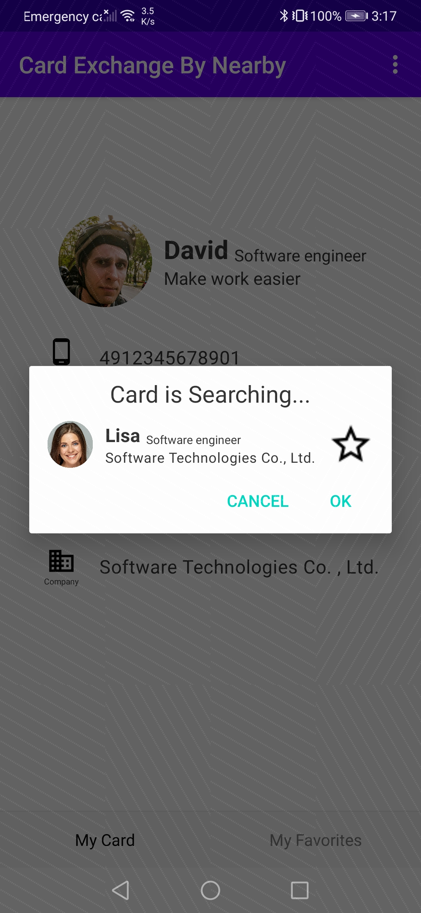

# NearbyMessageDemo-NearbyCardExchange

## Table of Contents

 * [Introduction](#introduction)
 * [Getting Started](#Getting Started)
 * [Supported Environments](#supported-environments)
 * [Procedure](#procedure)
 * [Result](#result)
 * [License](#license)

## Introduction
This demo demonstrates how to use both Huawei Nearby Service to exchange card. 

## Getting Started

1.Register as a developer.
Register a [HUAWEI account](https://developer.huawei.com/consumer/en/).
2.Create an app from Huawei.
Create an app and enable Nearby Service by referring the [Nearby Service Preparations](https://developer.huawei.com/consumer/en/doc/development/HMS-Guides/nearby-service-preparation).
3.Build the demo.
To build this project, please use "Import project" in Android Studio.
Prepare two Huawei phones, and install this app by adb command to phones.

## Supported Environments
Android Studio 3.X or a later version is recommended.

## Procedure
1. Open the app on both phones, create your persional card, click the exchange menu item, input the exchange code.
2. Finally, you find the card of each other, add the card to your favorites. Enjoy interaction with nearby card exchange!

## Result

## License
NearbyCardExchange sample is licensed under the [Apache License, version 2.0](http://www.apache.org/licenses/LICENSE-2.0).