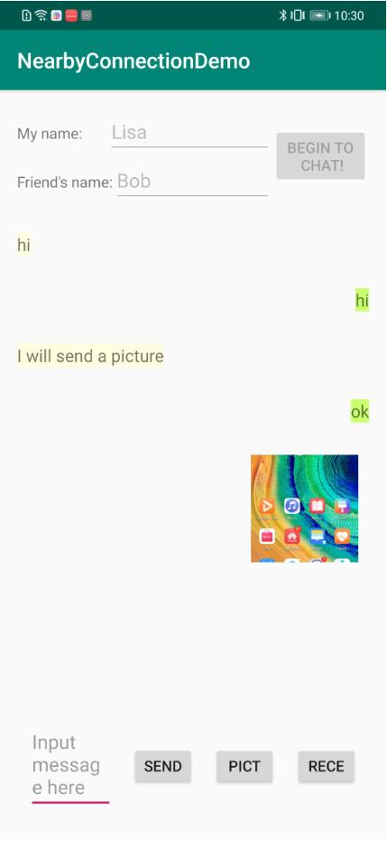
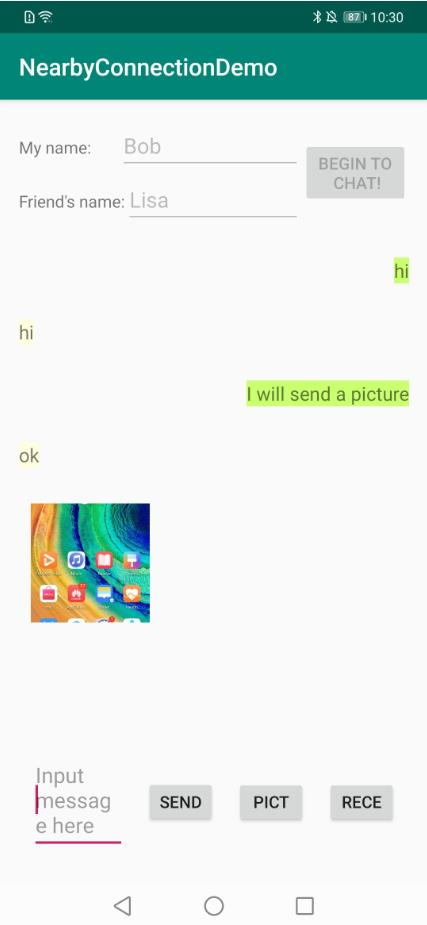

# NearbyConnectionDemo
English | [中文](https://github.com/HMS-Core/hms-nearby-demo/blob/master/NearbyConnection/README_ZH.md)

## Table of Contents

 * [Introduction](#introduction)
 * [More Scenarios](#more-scenarios)
 * [Getting Started](#Getting-Started)
 * [Procedure](#procedure)
 * [Supported Environment](#supported-environment)
 * [License](#license)
 
## Introduction
The NearbyConnectionDemo program demonstrates how to register an Android app providing functions including scanning, broadcasting, connection, and data sending data.

  

## More Scenarios

## Procedure
* Installation

1. Register as a developer.
Register a [HUAWEI account](https://developer.huawei.com/consumer/en/).
2. Create an app.
Create an app and enable Nearby Service by referring the [Nearby Service Preparations](https://developer.huawei.com/consumer/en/doc/development/HMSCore-Guides/config-agc-0000001050040578).
3. Build the demo.
To build this demo, please first import the demo to Android Studio (3.X or later). Then download the agconnect-services.json file of the app from AppGallery Connect, and add the file to the app directory (\app) of the demo. For details, please refer to [Nearby Service Preparations](https://developer.huawei.com/consumer/en/doc/development/HMSCore-Guides/config-agc-0000001050040578).

* Getting Started

1. Open the app on both phones, enter your name.
2. Enter your friend's name.
3. Tap BEGIN_TO_CHAT.
4. Tap SEND on either phone and enter the information that you want to send to the peer phone.

## Supported Environments
   Android Studio 3.X.

## License
Nearby Service Connection sample is licensed under the [Apache License, version 2.0](http://www.apache.org/licenses/LICENSE-2.0).
