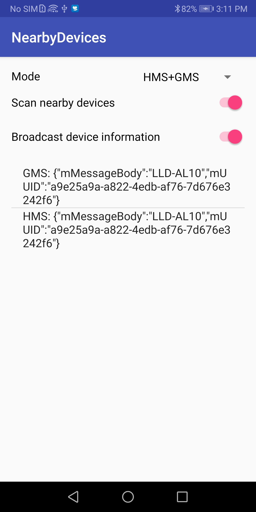

# NearbyMessageDemo-NearbyDevices

## Table of Contents

 * [Introduction](#introduction)
 * [Getting Started](#Getting-Started)
 * [Supported Environments](#supported-environments)
 * [Procedure](#procedure)
 * [Notes](#Notes)
 * [Result](#result)
 * [License](#license)

## Introduction
This demo demonstrates how to use both Huawei Nearby Service and Google Nearby Service simultaneously. 

## Getting Started

1.Register as a developer.
Register a [HUAWEI account](https://developer.huawei.com/consumer/en/).
2.Create an app from Huawei.
Create an app and enable Nearby Service by referring the [Nearby Service Preparations](https://developer.huawei.com/consumer/en/doc/development/HMS-Guides/nearby-service-preparation).
3.Create a project from Google.
Create a project on [Google Developer Console](https://console.developers.google.com/). Or, use an existing project. 
Click on `APIs & auth -> APIs`, and enable `Nearby Messages API`.
Click on `Credentials`, then click on `Create new key`, and pick `Android key`. Then register your Android app's SHA1 certificate fingerprint and package name for your app. 
Copy the API key generated, and paste it in `AndroidManifest.xml`.
4.Build the demo.
(1)To build this demo, please first import the demo in the Android Studio (3.x+). 
(2)Then download the file "agconnect-services.json" of the app on AGC, and add the file to the app root directory(\app) of the demo. Please refer to the Chapter [Integrating HMS SDK](https://developer.huawei.com/consumer/en/doc/development/HMS-Guides/nearby-service-integratesdk) of the Development Guide.
(3)Change the value of applicationid in the app-level build.gradle file of the sample project to the package name of your app.
(4)Prepare a Huawei phone, then install the compiled apk by adb command to phone.

## Supported Environments
Android Studio 3.X or a later version is recommended.

## Procedure
1. Open the app on both phones, select the Mode such as HMS+GMS, turn on the switch for scanning nearby devices, and turn on the switch for broadcasting nearby device.
2. Finally, you find each other. Enjoy interaction with nearby devices!

## Notes
1. By using both Huawei Nearby Service and Google Nearby Service simultaneously, the device might receive duplicate messages with the same content but comes from both Huawei Nearby Service and Google Nearby Service. In this case,it is suggested to add an adaption layer to uniformly take over the publishing and the subscribing of both the Google messages and the Huawei messages. For the publishing module, the key point is that you need to construct Google messages and Huawei messages by a message generation manager, and then call the publishing APIs of both the Google and the Huawei Nearby service. For the subscribing module, you need to maintain a message queue to deduplicate the received Google message and Huawei message whose are the same as having the same content. one solution to deduplicate two same messages is that you need to maintain a reference counter for them. For the first time a message is found by Google or Huawei Nearby service, you need to increase the reference counter by 1 and notify to the app that this message is on found. And you need to decrease the reference counter by 1 when the message is lost by Google or Huawei Nearby service. When the reference counter is decrease to 0, you need to notify to the app that this message is lost.
2. Note that a device that only supports Huawei Nearby service can not interate with another device that only supports Google Nearby Service. In this case, it is suggested to add a notification on the device with Huawei Nearby service only (which is usually the latest version of app, e.g., 4.1.1), notifying that the peer's app should be upgraded at least to a certain version (>=4.1.1).
 
## Result

## License
NearbyDevices sample is licensed under the [Apache License, version 2.0](http://www.apache.org/licenses/LICENSE-2.0).