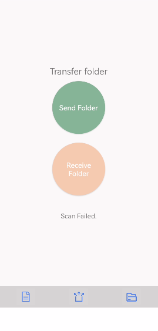

# HMS Core Nearby Service Sample Code (Nearby File Transfer)
English | [中文](README_ZH.md)
## Contents

 * [Introduction](#Introduction)
 * [Preparation](#Preparation)
 * [Environment Requirements](#Environment-Requirements)
 * [Running the Demo](#Running-the-Demo)
 * [Result](#Result)
 * [License](#License)

## Introduction
The sample code demonstrates how to build the nearby file transfer function for an Android app using methods in **NearbyAgent**.

## Preparation
1. Register as a developer on [HUAWEI Developers](https://developer.huawei.com/consumer/en/?ha_source=hms1).
2. Create an app in AppGallery Connect and enable Nearby Service by referring to [Preparations](https://developer.huawei.com/consumer/en/doc/development/system-Guides/config-agc-0000001050040578?ha_source=hms1).
3. Build the demo.
    Import the demo to Android Studio (3.0 or later). Download the **agconnect-services.json** file from AppGallery Connect, and add the file to the app-level directory of the demo project. For details, please refer to [Preparations](https://developer.huawei.com/consumer/en/doc/development/system-Guides/config-agc-0000001050040578?ha_source=hms1).
    After the building is complete, install the APK on two Huawei phones by running adb commands.

## Environment Requirements
   Android Studio 3.0 or later

## Running the Demo
1. Start the demo app on two Huawei phones.
2. Tap **Send File** and select the file to be sent.
3. Tap **Receive File** on the other phone.

>Note:
If the error code 907135701 is reported when you run the demo, verify that the **agconnect-services.json** file is correct for your project.  

## Result

## License
The sample code is licensed under [Apache License 2.0](http://www.apache.org/licenses/LICENSE-2.0).

