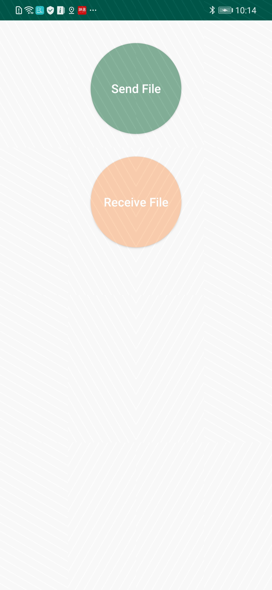

# 华为近距离通信服务示例代码（近距离文件传输）
中文 | [English](README.md)
## 目录

 * [简介](#简介)
 * [开发准备](#开发准备)
 * [环境要求](#环境要求)
 * [运行](#运行)
 * [结果](#结果)
 * [授权许可](#授权许可)

## 简介
本示例代码展示如何使用NearbyAgent为安卓应用开发近距离文件传输功能。

## 开发准备
1、在[开发者联盟]( https://developer.huawei.com/consumer/cn/)注册成为开发者。
2、在AppGallery Connect上创建应用并启用近距离通信服务。详情请参阅[开发准备](https://developer.huawei.com/consumer/cn/doc/development/system-Guides/config-agc-0000001050040578?ha_source=hms1)。
3、构建demo。
  将示例代码导入Android Studio（3.0及以上版本）。从AppGallery Connect获取agconnect-services.json文件并添加到项目的应用级根目录下。详情请参阅[开发准备](https://developer.huawei.com/consumer/cn/doc/development/system-Guides/config-agc-0000001050040578?ha_source=hms1)。
  构建完成后，运行adb命令，将APK安装到两台华为手机上。

## 环境要求
   Android Studio 3.0及以上版本

## 运行
1、在两台华为手机上启动demo。
2、在一台手机上点击“Send File”，选择要发送的文件。
3、在另一台手机上点击“Receive File”接收文件。

>注意：
若运行demo时出现错误码907135701，请检查项目的agconnect-services.json文件是否正确。

## 结果

## 授权许可
本示例代码经过[Apache License 2.0](http://www.apache.org/licenses/LICENSE-2.0)授权许可。
