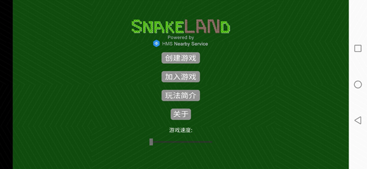
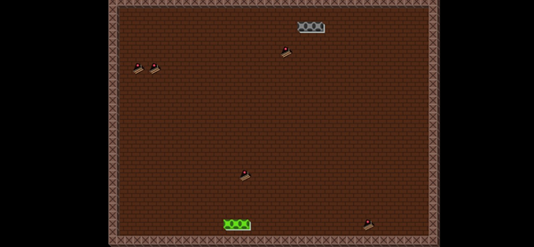

# NearbyGameSnake
[English](https://github.com/HMS-Core/hms-nearby-demo/tree/master/NearbyGameSnake)|中文

## 目录
 * [简介](#简介)
 * [更多场景](#更多场景)
 * [操作流程](#操作流程)
 * [环境要求](#环境要求)
 * [授权许可](#授权许可)

## 简介
本Demo介绍了一个简单的集成了Nearby Connection的在线蛇类游戏。通过Nearby Connection，两部智能手机很容易建立连接，然后一起玩网络游戏。

游戏大厅:

游戏中：

## 更多场景

## 操作流程
* 安装
1. 成为开发者，注册[华为帐号](https://developer.huawei.com/consumer/cn/)。

2. 创建应用。参考[开发准备](https://developer.huawei.com/consumer/cn/doc/development/HMSCore-Guides/config-agc-0000001050040578)创建应用并开启Nearby Service。

3. 构建Demo。
(1) 在Android Studio（3.x或以上版本）中导入该Demo。
(2) 在AGC下载应用的agconnect-services.json文件，并且将该文件添加到应用的根目录（\app）下。详细请参考开发指南中的[集成HMS Core SDK](https://developer.huawei.com/consumer/cn/doc/development/HMSCore-Guides/android-integrating-sdk-0000001050126093)章节。
(3) 修改样例工程中app-level build.gradle文件的applicationid值为您的App的包名。
(4) 准备两部华为手机，执行adb命令将应用安装到手机。

* 快速入门
1. 在两部手机上打开应用，在其中一部手机上单击“Create Game”，另一部手机上单击“Join Game”，开始发现对方。

2. 发现对方后，点击“Go”开始游戏。

## 环境要求
推荐使用Android Studio 3.X及以上版本。

## 授权许可
Nearby Service Connection示例代码经过[Apache2.0授权许可](http://www.apache.org/licenses/LICENSE-2.0)。