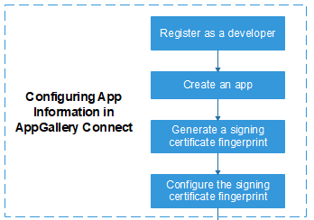
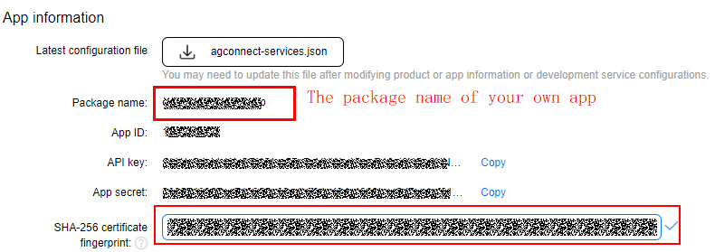
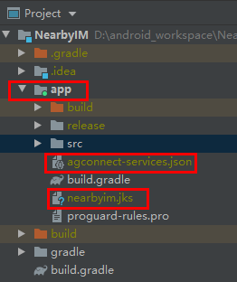
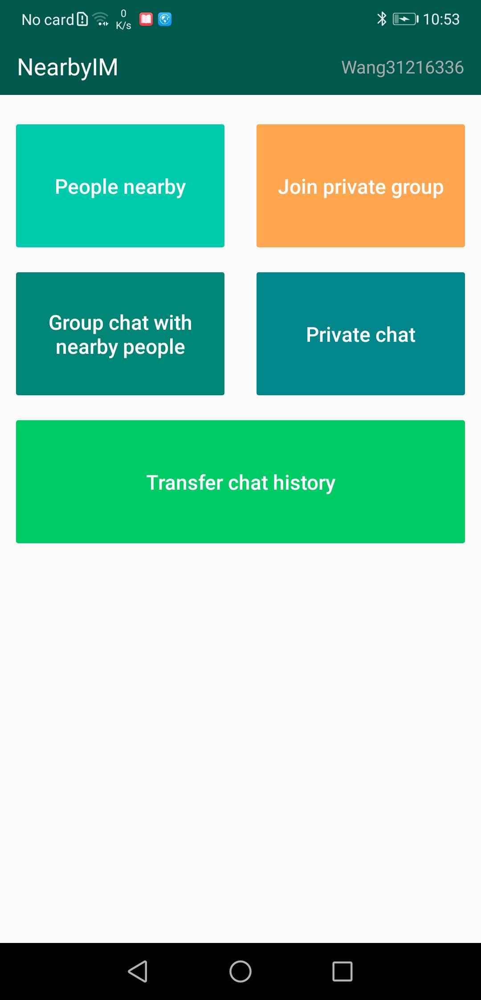
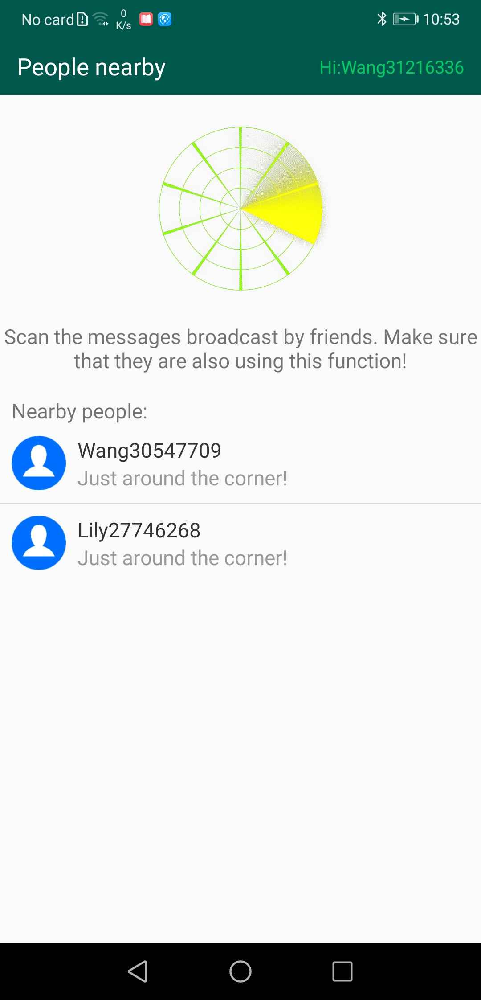
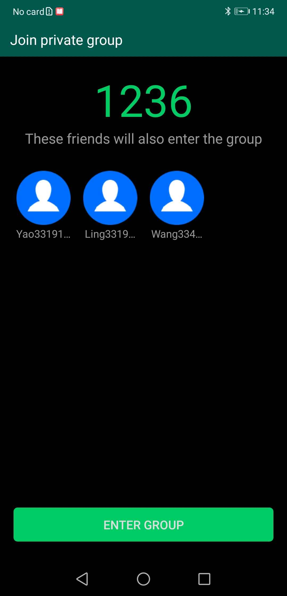
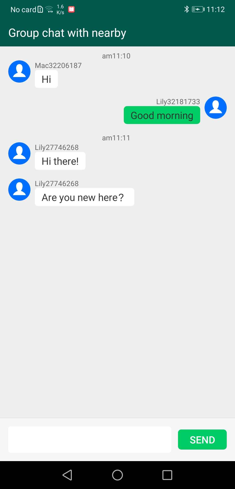
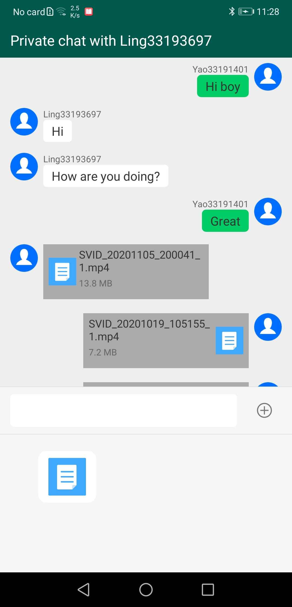

# NearbyIM

## Table of Contents

 * [Introduction](#introduction)
 * [Installation](#installation)
 * [Configuration](#configuration)
 * [Supported Environments](#supported-environments)
 * [Result](#result)
 * [License](#license)

## Introduction
Data Communication consists of Nearby Connection and Nearby Message(https://developer.huawei.com/consumer/cn/hms/huawei-nearbyservice/).
This app demonstrates a few of Nearby Service typical use cases:
Socialization with nearby strangers, accurately locate nearby persons using short-distance communication technologies, send message and shares files such as photos and videos.

## Installation
1.Configuring app information in appGallery connect.Create an app and enable Nearby Service by referring the [Nearby Service Preparations](https://developer.huawei.com/consumer/en/doc/development/HMS-Guides/nearby-service-preparation).

(1)Registering as a Developer,register a [HUAWEI account](https://developer.huawei.com/consumer/en/).Before you get started, you will need to register as a HUAWEI developer and complete identity verification on the HUAWEI Developer website. For details, please refer to Register a HUAWEI ID.Before you get started,you will need to register as a HUAWEI developer and complete identity verification on the HUAWEI Developer website. For details, please refer to Register a HUAWEI ID.
(2)Create an app by referring to Creating an AppGallery Connect Project and Adding an App to the Project.
(3)Generating a Signing Certificate Fingerprint.Generating your app's signature file and obtain the SHA-256 fingerprint from the result.

(4)Configuring the Signing Certificate Fingerprint
Note: If you need to develop the Nearby Message service, perform service configuration in AppGallery Connect first and then configure the signing certificate fingerprint.
  (a)Sign in to AppGallery Connect and select My apps.
  (b)Find your project from the project list and click the app on the project card.
  (c)On the Project Setting page, set SHA-256 certificate fingerprint to the SHA-256 fingerprint from Generating a Signing Certificate Fingerprint.
  
2.Build the demo.
(1)To build this demo, please first import the demo in the Android Studio (3.x+).
(2)Change the value of applicationid in the app-level build.gradle file of the sample project to the package name of your app.
(3)Then download the file "agconnect-services.json" of the app on AGC, and add the file to the app root directory(\app) of the demo. Please refer to the Chapter [Integrating HMS SDK](https://developer.huawei.com/consumer/en/doc/development/HMS-Guides/nearby-service-integratesdk) of the Development Guide.
  
(4)Prepare two Huawei phones, and install this app by adb command to phones.

## Configuration
1. Open the app on two or more mobile phones,click the same function;
2. Click on "People nearby" and you'll see nearby users;
3. Click on "Join private group", join a group chat with friends nearby by entering the required four digits;
4. Click on "Group chat with nearby people",you can communicate with people nearby;
5. Click on "Private chat", You can send text and files using the Nearby Connection" (https://developer.huawei.com/consumer/cn/hms/huawei-nearbyservice/).
6. Finally, enjoy with your nearby friends!

## Supported Environments
Android Studio 3.X or a later version is recommended.

## Result

## License
NearbyIM sample is licensed under the [Apache License, version 2.0](http://www.apache.org/licenses/LICENSE-2.0).