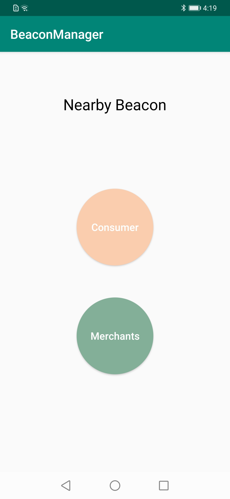
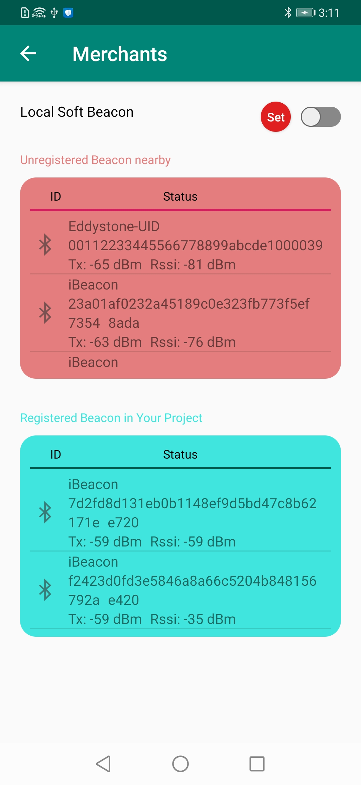

# NearbyMessageDemo-BeaconManager

## Table of Contents

 * [Introduction](#introduction)
 * [Getting Started](#Getting-Started)
 * [Supported Environments](#supported-environments)
 * [Procedure](#procedure)
 * [Result](#result)
 * [License](#license)

## Introduction
This demo demonstrates an example of using the API to manage beacons on the cloud. For details about the API, please refer to https://developer.huawei.com/consumer/en/doc/development/HMS-References/api-call-process.

## Getting Started

1. Register as a developer.
Register a [HUAWEI ID](https://developer.huawei.com/consumer/en/).
2. Create an app.
Create an app and enable Nearby Service by referring to [Nearby Service Preparations](https://developer.huawei.com/consumer/en/doc/development/HMS-Guides/nearby-service-preparation).
3.Build the demo.
(1)To build this demo, please first import the demo in the Android Studio (3.x+). 
(2)Then download the file "agconnect-services.json" of the app on AGC, and add the file to the app root directory(\app) of the demo. Please refer to the Chapter [Integrating HMS SDK](https://developer.huawei.com/consumer/en/doc/development/HMS-Guides/nearby-service-integratesdk) of the Development Guide.
(3)Change the value of applicationid in the app-level build.gradle file of the sample project to the package name of your app.
(4)Then set MESSAGE_HOST in the gradle file of the demo project (\app\build.gradle). For details about how to set MESSAGE_HOST, please refer to https://developer.huawei.com/consumer/en/doc/development/HMS-References/api-call-process.
(5)Prepare a Huawei phone and at least one BLE beacon, and install the compiled APK using the ADB on the phone.

## Supported Environments
Android Studio 3.0 or a later version is recommended.

## Procedure
1. Create a service account key and download the JSON file.
Sign in to [HUAWEI Developer](https://developer.huawei.com/consumer/en/), click **Console**, go to **HMS API Services** > **Credentials**, select the app project you have created, move the cursor to **Create credentials**, and click **Service account key**. Enter the information of service account key, and click **Create and download JSON** to download the JSON file.

2. Push the JSON file to the SD card.
For example, use the ADB to push the JSON file to **/sdcard/Download**.

3. Prepare at least one BLE beacon.

4. Open the app on the phone, tap **My Center**, and sign in by selecting the JSON file.

5. Tap **Unregistered** and refresh the page to find the BLE beacons. Tap a BLE beacon to register it, and perform others operations such as configuring the beacon attachments.

6. Tap **Registered** and check the BLE beacons you have registered. Tap a BLE beacon to view more information about it, and perform others operations such as configuring the beacon attachments.

7. Now, enjoy this app.

## Result

## License
 BeaconManager sample is licensed under the [Apache License, version 2.0](http://www.apache.org/licenses/LICENSE-2.0).