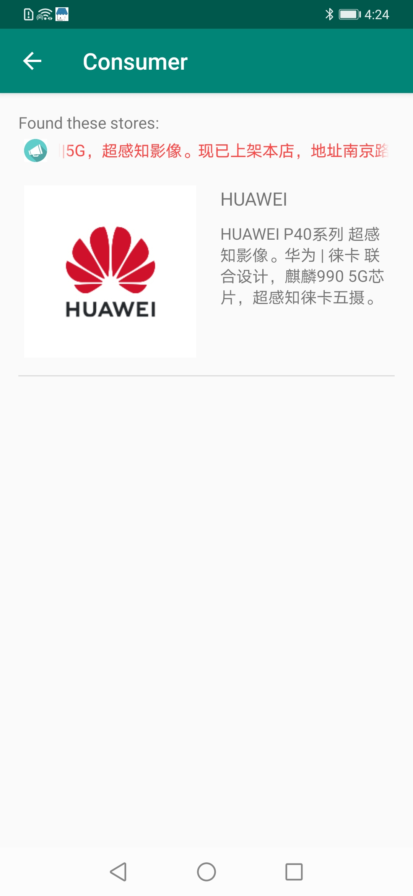

# NearbyStores
[English](README.md) | 中文

## 目录
 * [简介](#简介)
 * [操作流程](#操作流程)
 * [环境要求](#环境要求)
 * [授权许可](#授权许可)

## 简介
本Demo展示了Nearby Service中基于信标的消息发布和订阅。
1. 本demo分为消费者端和商家端，可以在应用启动后切换。
2. 消费者端可以接收到附近信标的营销消息。
3. 商家端可以配置附近信标信息附件来发布消息，也可以通过蓝牙功能把手机模拟为一个信标软件。

更多API信息，请参阅[API参考](https://developer.huawei.com/consumer/cn/doc/development/system-References/overview2-0000001061766323?ha_source=hms1).

## 操作流程
* 快速入门
1. 打开A手机App，单击“Merchants”，进入商家界面。
 

2. 单击"Set",为信标配置消息附件。

3. 打开"Local Soft Beacon"的开关。通知栏提示“软beacon已开启，您的手机成为一个beacon”
 

4. 您也可以通过单击“Unregistered Beacon nearby”列表中找到的蓝牙信标进行注册，并进行信标附件配置等操作。

5. 您可以单击“Registered Beacon in Your Project”列表中已注册的蓝牙信标。单击某个蓝牙信标可查看更多信息，并进行信标附件配置等操作。

6. 打开B手机App,单击“Consumer”。您就可以体验有趣的消息了！
 

>说明：本demo为了方便用户使用，已经把将相应的账号认证文件直接置于代码之中。如果需要更新自己的账号认证文件，您可以按照以下步骤操作：
>1. 成为开发者。注册[华为帐号](https://developer.huawei.com/consumer/cn/)。
>2. 创建应用。参考[开发准备](https://developer.huawei.com/consumer/cn/doc/development/system-Guides/config-agc-0000001050040578?ha_source=hms1)创建应用并开启Nearby Service。
>3. 创建服务帐户密钥并下载JSON文件。登录HUAWEI Developer，单击“管理中心”，进入“ HMS API服务>凭证”，选择已创建的应用程序项目，将光标移至“创建凭据”，然后单击“服务帐户密钥”。输入服务帐户密钥的信息，然后单击“创建并下载JSON”以下载JSON文件。
>4. 替换代码中JSON文件。具体路径为NearbyStores\app\src\main\assets。
>5. 使用签名证书来编译出可执行的APK。参考[生成签名证书](https://developer.huawei.com/consumer/cn/codelab/HMSPreparation/index.html#2)

## 环境要求
推荐使用Android Studio 3.0及以上版本。

## 授权许可
NearbyStores示例代码经过 [Apache 2.0 授权许可](http://www.apache.org/licenses/LICENSE-2.0)。
