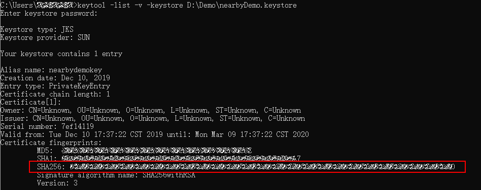
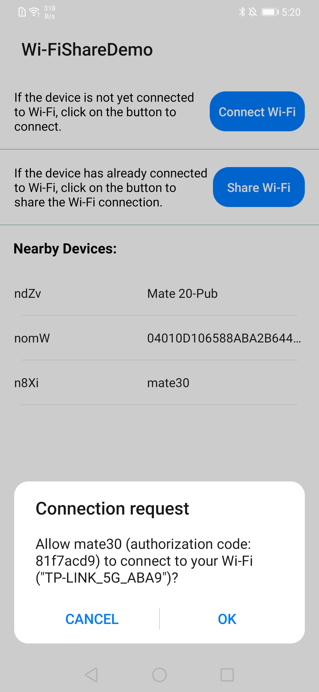
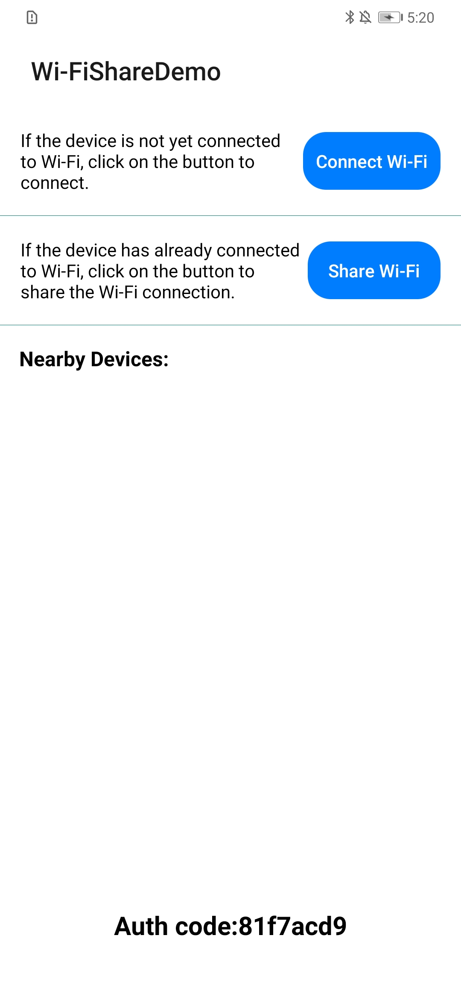

# NearbyWifiShareDemo
## Table of Contents

 * [Introduction](#introduction)
 * [Installation](#installation)
 * [Configuration ](#configuration )
 * [Supported Environment](#supported-environment)
 * [Result](#result)
 * [License](#license)

## Introduction
The NearbyWifiShareDemo program demonstrates how to complete an Android app providing nearby Wi-Fi share feature.

## Installation
1. Configuring app information in appGallery connect.Create an app and enable Nearby Service by referring the [Nearby Service Preparations](https://developer.huawei.com/consumer/en/doc/development/system-Guides/config-agc-0000001050040578?ha_source=hms1).
                                 
                                 
(1).Registering as a Developer,register a [HUAWEI account](https://developer.huawei.com/consumer/en/).Before you get started, you will need to register as a HUAWEI developer and complete identity verification on the HUAWEI Developer website. For details, please refer to Register a HUAWEI ID.Before you get started,you will need to register as a HUAWEI developer and complete identity verification on the HUAWEI Developer website. For details, please refer to Register a HUAWEI ID.

(2).Create an app by referring to Creating an AppGallery Connect Project and Adding an App to the Project.

(3).Generating a Signing Certificate Fingerprint.Generating your app's signature file and obtain the SHA-256 fingerprint from the result.

(4).Configuring the Signing Certificate Fingerprint
Note: If you need to develop the Nearby Message service, perform service configuration in AppGallery Connect first and then configure the signing certificate fingerprint.

  (a)Sign in to AppGallery Connect and select My apps.

  (b)Find your project from the project list and click the app on the project card.

  (c)On the Project Setting page, set SHA-256 certificate fingerprint to the SHA-256 fingerprint from Generating a Signing Certificate Fingerprint.

2. Build the demo.

(1)To build this demo, please first import the demo in the Android Studio (3.x+).

(2)Change the value of applicationid in the app-level build.gradle file of the sample project to the package name of your app.

(3)Then download the file "agconnect-services.json" of the app on AGC, and add the file to the app root directory(\app) of the demo. Please refer to the Chapter [Integrating HMS SDK](https://developer.huawei.com/consumer/en/doc/development/system-Guides/android-integrating-sdk-0000001050126093?ha_source=hms1) of the Development Guide.

(4)Prepare two Huawei phones, and install this app by adb command to phones.

## Configuration
1. Open the app on both phones(named A and B, A is connected to Wi-Fi, B is not connected to Wi-Fi).
2. Tap the button of "Share Wi-Fi" on one phone(A) to share Wi-Fi to other one(B).
3. Tap the button of "Connect Wi-Fi" on B to connect Wi-Fi.
4. When A found B, there will be a dialog of Connection Request after click the item, and select OK to share Wi-Fi to B.

## Supported Environment
   Android Studio 3.X.

## Result

## License
NearbyWifiShareDemo is licensed under the [Apache License, version 2.0](http://www.apache.org/licenses/LICENSE-2.0).
